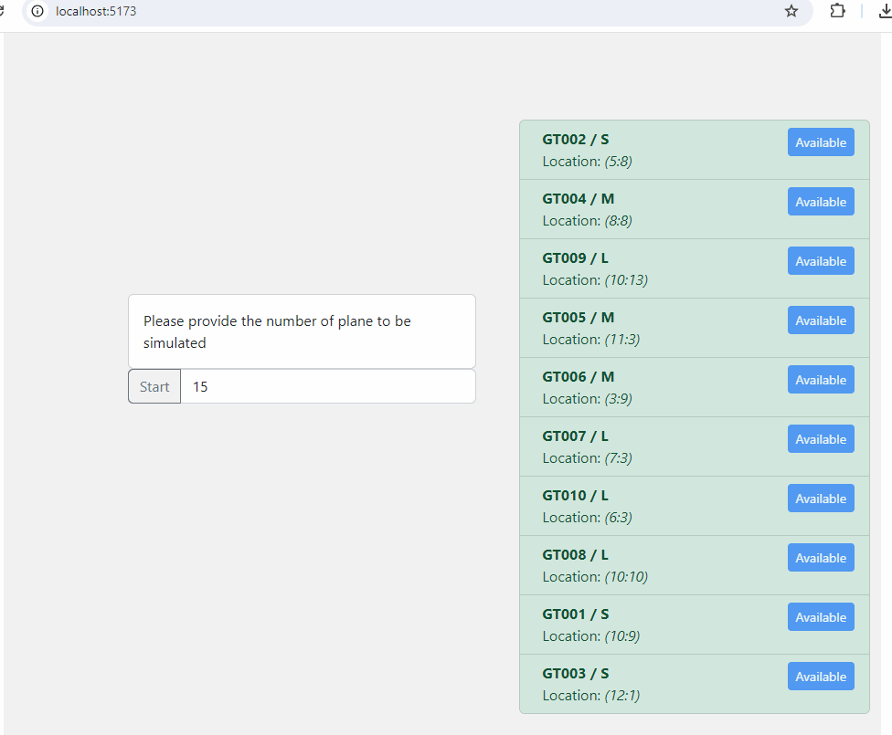

# thy-case

<details>
    <summary>Directives</summary>

     `Türkçe'si altta`
 
Airports need gate assignment systems that direct planes to gates. These systems choose the best gate based on the plane's size and the distance to the gate. Timing between landings and takeoffs is very important at airports. Also, with these systems, planes can be unloaded faster and easier, making passengers' travel more comfortable.

It is also important to track incoming plane and gate information in real time. A screen that shows this information helps airport staff manage flights better. The tracking screen needs to show gate statuses, assignments made, and planes waiting in line.

With this information and the criteria below, a Gate Planner case study is expected to be done, including screens for plane-gate matching and status tracking.

## Task Descriptions

1. The case study will be conducted for a scenario with one runway.

2. The gates on the runway will be specified by their X and Y positions in a matrix.
    + There are 10 gates at the airport.

3. Planes landing on the runway will always start at location (0,0).

4. The data structure for the gate and the landed plane is as follows:
+ Gate:

``` js
{
    "Id": Guid,
    "Code": string: “GT001”, “GT002”, etc.,
    "Size": string: ["S", "M", "L" ],
    "Status": string: ["Available", "InUse"],
    "Location": {
        "X": int,
        "Y": int
    }
}
```
 
+ Plane:

``` js
{
    "Id": Guid,
    "Code": string: “TK001”, “AJ002”, etc.,
    "Size": string: ["S", "M", "L" ],
    "Status": string:[OnGate, Ground]
}
```

+ Status descriptions are as follows:
i. **Available:** Gate is available.
ii. **InUse:** Gate is in use.
iii. **OnGate:** Plane has been matched with an available gate.
iv. **Ground:** Plane is waiting as no suitable gate is available.

5- The size hierarchy is S < M < L.

## Task Rules

1. Only planes with codes starting with "TK" will be processed.
2. A plane can stay at a gate for a maximum of 30 minutes.
 + For the test and evaluation process, this time will be considered as 30 seconds.
3. If no suitable gate is available, planes must wait in "Ground" status. When a gate becomes available, planes should be processed in order.
4. Matching should be done considering gate and plane sizes.
+ The closest gate should always be prioritized.
5. There must be a minimum of 20 incoming plane data entries.
+ The number of incoming planes should always exceed the number of available gates.
6.  The ability to arrange and dynamically manage gates through a screen will add extra value during the evaluation process.

---

Havalimanları, uçakların kapılara yönlendirilmesini sağlayan kapı eşleştirme sistemlerine ihtiyaç duyarlar. Bu sistemler aracılığı ile uçağın boyutu ve kapıya olan uzaklığına göre en uygun kapı seçilir. Havalimanlarında, uçakların iniş ve kalkışları arasında zamanlama çok önemlidir. Ayrıca bu sistem sayesinde uçaklar daha hızlı ve kolay bir şekilde tahliye edilmekte ve yolcuların seyahatleri daha konforlu hale getirilmektedir.
Gelen uçak ve kapı bilgilerinin anlık olarak takip edilmesi de önemlidir. Bu bilgilerin takip edildiği bir ekran, havalimanındaki personelin uçuşları daha iyi yönetmesine yardımcı olmaktadır. Takip ekranında kapıların durumları, yapılan eşleştirme ve sıra bekleyen uçakların görüntülenmesi gerekmektedir.
Bu bilgiler ve aşağıdaki kriterlerle birlikte, uçak - kapı eşleşmesini sağlayacak bir akış ve durum takibini sağlayacak ekranları içeren Gate Planner vaka çalışmasının yapılması beklenmektedir.

## Görev tanımları

1. Vaka çalışması içerisinde 1 pist bulunduran senaryo için yapılacaktır.
2. Pist üzerindeki kapılar matris şeklinde X, Y konumları ile belirtilecektir.
+ Havalimanında 10 adet kapı bulunmaktadır.
3. Piste inen uçaklar her zaman lokasyon olarak (0,0) konumundan başlar.
4. Kapı ve piste inmiş olan uçak veri yapısı aşağıdaki gibidir.

+ Kapı:

``` js
{
    "Id": Guid,
    "Code": string: “GT001”, “GT002”, etc.,
    "Size": string: ["S", "M", "L" ],
    "Status": string: ["Available", "InUse"],
    "Location": {
        "X": int,
        "Y": int
    }
}
```
 
+ Uçak:

``` js
{
    "Id": Guid,
    "Code": string: “TK001”, “AJ002”, etc.,
    "Size": string: ["S", "M", "L" ],
    "Status": string:[OnGate, Ground]
}
```
+ Durum açıklamaları aşağıdaki gibidir.
i. **Available:** Uygun kapı.
ii. **InUse:** Kullanımda olan kapı.
iii. **OnGate:** Uygun kapı bulunarak eşleştirilmiş uçak.
iv. **Ground:** Uygun kapı bulunmadığı için sırada bekleyen uçak.

5. Boyut sıralaması S < M < L şeklindedir.

## Görev Kuralları
1. Sadece uçak kodu “TK” ile başlayan uçaklar işleme alınacaktır.
2. Bir kapı içerisinde bir uçak en fazla 30 dakika bulunabilir.
+ Süre, test ve değerlendirme süreci boyunca 30 saniye olarak kabul edilecektir.
3. Uygun kapı bulunamayan durumda uçakların “Ground” durumunda beklemesi gerekir. Kapı uygunluğu sağlandığında sırasıyla işlenmeye devam edilmelidir.
4. Kapılar ve uçak boyutları dikkate alınarak eşleşme yapılmalıdır.
+ Her zaman en yakın kapı önceliklendirilmelidir.
5. Minimumda 20 adet gelen uçak verisi bulunmalıdır.
+ Gelen uçak verisi mevcut kapı sayısından her zaman fazla olmalıdır.
6. Kapıların bir ekran üzerinden düzenlenebilmesi ve dinamik olarak yönetilebilmesi değerlendirme sürecinde artı değer sağlayacaktır.
</details>


<details>
    <summary>Solution</summary>

    Details will be provided soon
    


</details>
